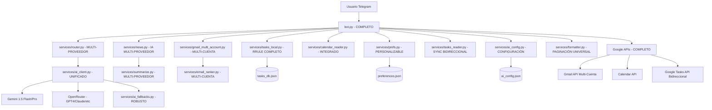

# Design Document - FINAL ARCHITECTURE ✅

## Implementation Status: COMPLETED

**Architecture Type:** Modular Microservices  
**AI Support:** Multi-Provider (Gemini + OpenRouter)  
**Gmail Support:** Multi-Account with Parallel Processing  
**Task Management:** Complete RRULE + Local + Google Sync  
**Interface:** Interactive Telegram UI with Dynamic Configuration

## Overview

Arquitectura final implementada de un bot de Telegram que actúa como asistente personal inteligente. Sistema modular con soporte multi-proveedor de IA, multi-cuenta Gmail, gestión completa de tareas con recurrencia RRULE, e interfaz interactiva para configuración dinámica.

**Características arquitectónicas implementadas:**
- ✅ 9 servicios modulares independientes
- ✅ Cliente de IA unificado (Gemini + OpenRouter)
- ✅ Configuración dinámica desde Telegram
- ✅ Fallbacks robustos automáticos
- ✅ Procesamiento paralelo optimizado
- ✅ Interfaz interactiva completa

## Architecture

### Final Architecture



### Modificaciones por Servicio

## ✅ IMPLEMENTED SERVICES

### Core AI Services
- **services/ai_client.py** ✅ - Cliente unificado multi-proveedor (Gemini + OpenRouter)
- **services/ai_config.py** ✅ - Configuración dinámica con 9 modelos disponibles
- **services/ai_fallbacks.py** ✅ - Sistema de fallbacks robusto para todos los servicios
- **services/router.py** ✅ - Router de IA con detección de intents y fallbacks

### Task Management Services  
- **services/tasks_local.py** ✅ - Gestión completa con RRULE, persistencia JSON
- **services/tasks_reader.py** ✅ - Sincronización bidireccional con Google Tasks

### Communication Services
- **services/gmail_multi_account.py** ✅ - Soporte multi-cuenta con procesamiento paralelo
- **services/email_ranker.py** ✅ - Ranking inteligente multi-cuenta con IA
- **services/calendar_reader.py** ✅ - Integración Google Calendar
- **services/news.py** ✅ - Lectura RSS feeds
- **services/summarize.py** ✅ - Resumen de noticias multi-proveedor

### UI & Formatting Services
- **services/formatter.py** ✅ - Paginación universal para todos los mensajes
- **services/prefs.py** ✅ - Sistema de preferencias personalizable
- **bot.py** ✅ - Interfaz completa con configuración interactiva de IA

## Components and Interfaces

### 1. Router Service (services/router.py) - NUEVO

**Propósito**: Usar múltiples proveedores de IA (Gemini 1.5 Flash o OpenRouter) para analizar instrucciones de usuario y devolver JSON estructurado con intent y argumentos.

**Interface**:
```python
async def route_instruction(instruction: str) -> dict:
    """
    Analiza instrucción con IA y devuelve JSON:
    {"intent": "add|recur|listar|completar|ajustar_prefs|brief", "args": {...}}
    
    Si hay ambigüedad: {"intent": "clarify", "message": "..."}
    Si falla IA: usar fallback heurístico
    """

def get_ai_client():
    """
    Retorna cliente de IA según AI_PROVIDER:
    - gemini: Google Generative AI
    - openrouter: OpenAI client con OpenRouter endpoint
    """

def fallback_parse(instruction: str) -> dict:
    """
    Fallback heurístico usando regex para patrones comunes
    cuando falla cualquier proveedor de IA
    """
```

**Configuración Multi-Proveedor**:
- Variables de entorno: AI_PROVIDER, GEMINI_API_KEY, OPENROUTER_API_KEY, OPENROUTER_MODEL
- Soporte para Gemini 1.5 Flash y modelos de OpenRouter (GPT-4, Claude, etc.)
- Prompts optimizados para cada proveedor
- Fallback automático a heurística si falla cualquier proveedor

### 2. Tasks Local Service (services/tasks_local.py) - NUEVO

**Propósito**: Gestión completa de tareas locales con persistencia en tasks_db.json y soporte RRULE.

**Estructura tasks_db.json**:
```json
{
  "tasks": [
    {
      "id": "t_172311...",
      "title": "Pagar impuestos", 
      "notes": "",
      "priority": "high",
      "due": "2025-09-01T09:00:00-06:00",
      "completed": false,
      "createdAt": "2025-08-08T10:30:00-06:00",
      "updatedAt": "2025-08-08T10:30:00-06:00", 
      "source": "local",
      "rrule": "FREQ=MONTHLY;BYMONTHDAY=1"
    }
  ]
}
```

**Funciones Requeridas**:
```python
def add_task(title, notes, priority, due) -> str
def add_recurrent_task(title, rrule, notes, priority, start_due) -> str  
def expand_for_today(tz) -> List[dict]  # Instancias recurrentes de hoy
def list_today_sorted(tz) -> List[dict]  # Ordenado por prioridad y hora
def complete_task(id) -> bool
```

**Integración Google Tasks**:
- Si SYNC_GOOGLE_TASKS=true, crear copia en Google Tasks al crear tarea local
- Para recurrentes, crear en Google Tasks solo cuando se expande instancia del día

### 3. Bot Commands Enhancement (bot.py) - MODIFICADO

**Comandos Nuevos a Agregar**:
```python
async def cmd_tasks(update, context):
    """Lista tareas del día usando list_today_sorted() + Google Tasks si sync"""

async def cmd_add(update, context):  
    """Pasa <texto> por router y crea tarea"""

async def cmd_recur(update, context):
    """Pasa <texto> por router y crea tarea recurrente"""

async def cmd_done(update, context):
    """Marca tarea como completada usando complete_task(id)"""

async def cmd_ia(update, context):
    """Pasa instrucción completa por router y ejecuta acción detectada"""
```

**Teclado Interactivo**:
```python
def get_main_keyboard() -> ReplyKeyboardMarkup:
    """
    Botones: Brief 🗞, Tareas de hoy ✅, Añadir tarea ➕, 
             Recurrente ♻️, Preferencias ⚙️
    """

def get_task_inline_keyboard(task_id: str) -> InlineKeyboardMarkup:
    """Botones contextuales: 'Marcar como hecha', etc."""
```

**Modificar /start**:
- Agregar display del teclado principal con botones

### 4. Message Pagination (services/formatter.py) - MODIFICADO

**Propósito**: Implementar paginación universal para todos los mensajes largos, no solo /brief.

**Funciones a Agregar**:
```python
def paginate_message(content: str, max_length: int = 3800) -> List[str]:
    """
    Divide mensaje en chunks ≤ 3800 caracteres
    Respeta límites de palabras y formato
    """
    
async def send_paginated_message(bot, chat_id: int, content: str, parse_mode=None):
    """
    Envía mensaje automáticamente paginado si excede límite
    Aplicar a TODAS las respuestas: /brief, /tasks, /prefs, etc.
    """
```

**Modificar Funciones Existentes**:
- Aplicar paginación a format_brief(), format_tasks_list(), format_preferences()
- Asegurar que todas las respuestas del bot usen paginación automática

### 5. Google Tasks Integration (services/tasks_reader.py) - MODIFICADO

**Propósito**: Agregar capacidad de escritura a Google Tasks para sincronización opcional.

**Funciones Nuevas a Agregar**:
```python
async def create_google_task(title: str, notes: str = "", due: Optional[datetime] = None) -> Optional[str]:
    """Crear tarea en Google Tasks, devolver ID de Google"""

async def sync_local_to_google(local_task: dict) -> Optional[str]:
    """Sincronizar tarea local específica a Google Tasks"""
```

**Funciones Existentes a Mantener**:
```python
async def fetch_pending_tasks() -> List[dict]  # Ya existe - no modificar
```

**Lógica de Sincronización**:
- Solo si SYNC_GOOGLE_TASKS=true en variables de entorno
- Al crear tarea local normal: crear inmediatamente en Google Tasks
- Al expandir tarea recurrente para hoy: crear esa instancia en Google Tasks
- Mantener IDs separados (local vs Google Tasks)

## Data Models

### tasks_db.json Structure (NUEVO)
```json
{
  "tasks": [
    {
      "id": "t_172311...",
      "title": "Pagar impuestos",
      "notes": "",
      "priority": "high",
      "due": "2025-09-01T09:00:00-06:00",
      "completed": false,
      "createdAt": "2025-08-08T10:30:00-06:00",
      "updatedAt": "2025-08-08T10:30:00-06:00",
      "source": "local",
      "rrule": "FREQ=MONTHLY;BYMONTHDAY=1"
    }
  ]
}
```

### preferences.json Structure (EXISTENTE - NO MODIFICAR)
```json
{
  "top_k": 10,
  "only_unread": false,
  "min_importance": "any",
  "priority_domains": [],
  "priority_senders": [],
  "blocked_domains": [],
  "blocked_senders": [],
  "blocked_keywords": ["newsletter", "promo", "boletín", "no-reply"]
}
```

### Router Response Format (NUEVO)
```json
{
  "intent": "add|recur|listar|completar|ajustar_prefs|brief",
  "args": {
    "title": "cortarme el cabello",
    "due": "2025-08-10",
    "time": "17:00", 
    "priority": "medium"
  }
}
```

### Fallback Response (cuando falla Gemini)
```json
{
  "intent": "clarify",
  "message": "No pude entender la instrucción, usando fallback heurístico"
}
```

## Error Handling y Fallbacks

### Fallbacks Globales de IA (REQUERIMIENTO CRÍTICO)
1. **Router Service**: Si Gemini falla → usar regex para detectar patrones básicos (add, recur, done)
2. **Summarize Service**: Si Gemini falla → usar primeras líneas de noticias como resumen
3. **Email Ranker**: Si Gemini falla → usar heurística básica (remitente, asunto, fecha)
4. **Parse Recurrentes**: Si Gemini falla → usar patrones regex para RRULE básico

### Implementación de Fallbacks
```python
def with_ai_fallback(ai_function, fallback_function):
    """
    Wrapper para todas las funciones que usan IA
    Si falla IA → ejecutar fallback y notificar usuario
    """
    try:
        return ai_function()
    except Exception as e:
        logger.warning(f"AI failed: {e}, using fallback")
        return fallback_function()
```

### Manejo de Errores Existentes
- Mantener manejo actual de Google APIs, Telegram API, persistencia
- Agregar fallbacks específicos solo para servicios de IA

## Testing Strategy

### Unit Tests
- **Router Service**: Test de clasificación de intents y extracción de parámetros
- **Tasks Local**: Test de RRULE expansion y operaciones CRUD
- **Formatter**: Test de paginación de mensajes
- **AI Services**: Test con mocks de Gemini API

### Integration Tests
- **Google APIs**: Test con credenciales de desarrollo
- **End-to-End**: Test de flujos completos desde comando hasta respuesta
- **Persistence**: Test de lectura/escritura de JSON files

### Performance Tests
- **Brief Generation**: Verificar tiempo < 25 segundos
- **Concurrent Operations**: Test de operaciones paralelas con asyncio
- **Memory Usage**: Verificar uso eficiente de memoria con grandes datasets

### User Acceptance Tests
- **Command Processing**: Verificar que todos los comandos funcionan correctamente
- **Keyboard Interaction**: Test de botones y navegación
- **Error Scenarios**: Verificar manejo graceful de errores

## Optimización del Brief (REQUERIMIENTO CRÍTICO)

### Procesamiento Paralelo con asyncio.gather()
```python
async def generate_brief():
    """
    Ejecutar en paralelo:
    - Lectura de noticias RSS
    - Procesamiento de Gmail 
    - Lectura de Google Calendar
    - Lectura de Google Tasks + tareas locales
    """
    news_task = asyncio.create_task(fetch_and_summarize_news())
    gmail_task = asyncio.create_task(fetch_and_rank_emails()) 
    calendar_task = asyncio.create_task(fetch_calendar_events())
    tasks_task = asyncio.create_task(fetch_all_tasks())
    
    news, emails, events, tasks = await asyncio.gather(
        news_task, gmail_task, calendar_task, tasks_task
    )
    
    return format_brief(news, emails, events, tasks)
```

### Límite de Tiempo y Timeout de Telegram
- **Respuesta inmediata**: Bot responde en <2 segundos para evitar timeout de Telegram
- **Procesamiento en background**: Brief se genera en background con timeout de 20 segundos
- **Timeouts individuales**: Cada operación tiene timeout específico
- **Resultados parciales**: Si una operación falla, continuar con las demás

## Security Considerations

### Credential Management
- Usar variables de entorno para todas las API keys
- Implementar rotación automática de tokens OAuth
- Nunca logear credenciales o tokens

### Data Privacy
- Encriptar datos sensibles en archivos JSON
- Implementar cleanup automático de datos antiguos
- Respetar configuraciones de privacidad del usuario

### Input Validation
- Sanitizar todas las entradas del usuario
- Validar formatos de fecha/hora antes de procesamiento
- Limitar tamaño de inputs para prevenir DoS

## Actualización de Dependencias y Documentación

### requirements.txt (MODIFICAR)
```txt
# Dependencias existentes (mantener)
python-telegram-bot
google-generativeai  
google-api-python-client
feedparser
# ... otras existentes

# Nueva dependencia requerida
python-dateutil  # Para manejo de RRULE y parsing de fechas/hora
```

### README.md (ACTUALIZAR)
Agregar secciones:
- Nuevos comandos: /tasks, /add, /recur, /done, /ia
- Ejemplos de uso con lenguaje natural
- Configuración de SYNC_GOOGLE_TASKS
- Explicación del teclado interactivo
- Ejemplos de tareas recurrentes con RRULE

## ✅ CONFIGURATION IMPLEMENTED

### Environment Variables (Complete)
```env
# Telegram Bot
TELEGRAM_BOT_TOKEN=your_token
TIMEZONE=America/Mexico_City

# Google APIs
GOOGLE_CREDENTIALS_PATH=credentials.json
GOOGLE_TOKEN_PATH=token.json
SYNC_GOOGLE_TASKS=false

# Gmail Multi-Account (NEW)
GMAIL_ACCOUNTS=account1,account2,account3

# AI Multi-Provider (NEW)
AI_PROVIDER=gemini                    # gemini | openrouter
GEMINI_API_KEY=your_gemini_key
OPENROUTER_API_KEY=your_openrouter_key
OPENROUTER_MODEL=gpt-4               # 7 models available
```

### Available AI Models (9 Total)
**Gemini Models (2):**
- gemini-1.5-flash (fast & efficient)
- gemini-1.5-pro (powerful & precise)

**OpenRouter Models (7):**
- gpt-4, gpt-3.5-turbo (OpenAI)
- claude-3-opus, claude-3-sonnet, claude-3-haiku (Anthropic)
- llama-3-70b (Meta)
- mixtral-8x7b (Mistral)

### Data Files (4)
- **tasks_db.json** - Local tasks database with RRULE
- **ai_config.json** - Dynamic AI configuration
- **preferences.json** - User preferences
- **.env** - Environment variables